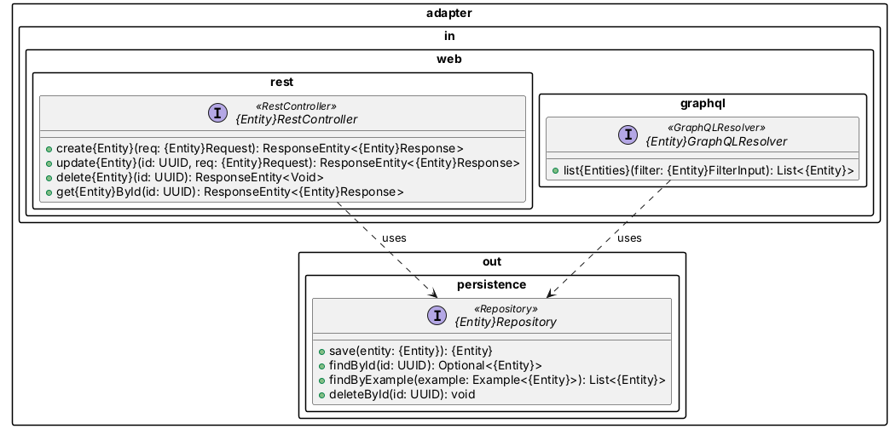

# Skill: PlantUML Interface Contract Generator

## ℹ️ Objective
Receives the same structured metadata snapshot produced by the `diagram-parser` skill and emits one `*_contract.puml` file per `<<Entity>>` resource. Each file formally declares the mandatory **RestController**, **GraphQLResolver**, and **Repository** interfaces for that resource, including all operation signatures, following the Onion Architecture and CQRS patterns. Optional **Service** ports are generated when custom actions are present.

## 🏗️ Architecture Constraints

### Layer Mapping (Onion)
| Stereotype | PlantUML Layer Tag | Package |
|---|---|---|
| `<<RestController>>` | `<<interface>>` | `adapter.in.web.rest` |
| `<<GraphQLResolver>>` | `<<interface>>` | `adapter.in.web.graphql` |
| `<<Repository>>` | `<<interface>>` | `adapter.out.persistence` |
| `<<Service>>` (Command) | `<<interface>>` | `application.port.in` |
| `<<Service>>` (Query) | `<<interface>>` | `application.port.in` |

> **RestController** and **GraphQLResolver** are both mandatory. They are **protocol adapters only** — they must not contain business logic. Both delegate to the same Service ports.

### Protocol Responsibility Split
| Operation | Protocol | Rationale |
|---|---|---|
| `POST` (Create) | REST only | Mutation with `201 Created` semantics |
| `PUT` (Update) | REST only | Idempotent mutation |
| `DELETE` | REST only | Mutation |
| Custom Actions | REST only | `POST /{id}:{action}` verb semantics |
| `GET` by ID | REST *(optional)* | Single-resource lookup; REST acceptable |
| Collection Query | **GraphQL only** | OAS bans Collection GET; GraphQL is the designated query gateway |
| Filtered / nested Query | **GraphQL only** | Flexible field selection is GraphQL's strength |

### CQRS Separation Rule
- **Command operations** (`Create`, `Update`, `Delete`, custom actions) → belong to a `*CommandService` interface.
- **Query operations** (`GetById`, collection reads) → belong to a `*QueryService` interface.
- Both `RestController` and `GraphQLResolver` depend on the relevant service interfaces via constructor injection (shown as `..>` dependency arrows).

---

## 🛠️ Generation Rules

### 1. File Naming
- One file per `<<Entity>>`: `{entity_name_snake_case}_contract.puml`
- Example: `StudentGrade` → `student_grade_contract.puml`

### 2a. Mandatory Interface: `<<RestController>>`
Generate an interface in the `adapter.in.web.rest` package for **mutation + single-resource** operations only:

| Metadata verb / action | RestController method signature |
|---|---|
| `POST` (Create) | `+ create{Entity}(@RequestBody {Entity}Request req): ResponseEntity<{Entity}Response>` |
| `GET` (Element) | `+ get{Entity}ById(@PathVariable UUID id): ResponseEntity<{Entity}Response>` |
| `PUT` (Update) | `+ update{Entity}(@PathVariable UUID id, @RequestBody {Entity}Request req): ResponseEntity<{Entity}Response>` |
| `DELETE` | `+ delete{Entity}(@PathVariable UUID id): ResponseEntity<Void>` |
| `Custom Action` | `+ {action}({Entity}ActionRequest req): ResponseEntity<OperationStatus>` |

- Class name: `{Entity}RestController`
- Annotate with `<<RestController>>`
- **Never** include collection-list operations here.

### 2b. Mandatory Interface: `<<GraphQLResolver>>`
Generate an interface in the `adapter.in.web.graphql` package for **query** operations:

| Operation type | GraphQLResolver method signature |
|---|---|
| Collection Query | `+ list{Entities}(filter: {Entity}FilterInput): List<{Entity}>` |
| Element Query | `+ get{Entity}ById(id: UUID): {Entity}` *(mirror of REST GET, optional)* |
| Custom Query Action | `+ {queryAction}({Entity}QueryInput): {ReturnType}` |

- Class name: `{Entity}GraphQLResolver`
- Annotate with `<<GraphQLResolver>>`
- **Never** include mutation operations (POST/PUT/DELETE) here.

### 3. Mandatory Interface: `<<Repository>>`
Generate an interface in the `adapter.out.persistence` package derived directly from the `<<Repository>>` operations in the metadata:

| Repository method in UML / Query support | Interface method signature |
|---|---|
| `Create()` | `+ save(entity: {Entity}): {Entity}` |
| `GetById()` | `+ findById(id: UUID): Optional<{Entity}>` |
| `Update()` | `+ save(entity: {Entity}): {Entity}` *(same as Create — unified `save`)* |
| `Delete()` | `+ deleteById(id: UUID): void` |
| `Collection Query` support | `+ findByExample(example: Example<{Entity}>): List<{Entity}>` |

- Class name: `{Entity}Repository`
- Annotate with `<<Repository>>`
- Extend `JpaRepository<{Entity}, UUID>` when the metadata `hardening_flags.put_sync` is true (signals Spring Data backing).

### 4. Optional Interfaces: `<<Service>>` Ports (CQRS)
Generate only when **custom actions** exist in metadata:

- `{Entity}CommandService` — one method per Create/Update/Delete/Custom Action verb.
- `{Entity}QueryService` — one method per Get/Query verb.

### 5. Dependency Arrows
Draw the following `..>` (usage/dependency) arrows to express wiring:

```
{Entity}RestController    ..> {Entity}CommandService : uses
{Entity}RestController    ..> {Entity}QueryService   : uses (GET by ID)
{Entity}GraphQLResolver   ..> {Entity}QueryService   : uses
{Entity}CommandService    ..> {Entity}Repository     : uses
{Entity}QueryService      ..> {Entity}Repository     : uses
```

If no Service interfaces are generated, draw both adapters → Repository directly.

### 6. Version / Concurrency Annotation
If `hardening_flags.409_required` is `true`, add the note:
```
note right of {Entity}Repository
  Optimistic Locking enforced.
  Repository MUST check version field before save.
end note
```

---

## ⚙️ Output Format

Each generated file MUST follow this skeleton exactly:



---

## ⚠️ Hard Constraints
- **Scope**: Generate one contract file **per `<<Entity>>`** only. Ignore non-entity classes.
- **Protocol Boundary**: Mutations MUST NOT appear in `GraphQLResolver`. Collection queries MUST NOT appear in `RestController`.
- **Mandatory Operations**: Never omit an operation that has a corresponding verb in the metadata `allowed_verbs` list.
- **No Hallucination**: Do not invent operations not present in the metadata. Use `FIXME_OPERATION` for unresolvable verb mappings.
- **Naming Convention**: Interface names MUST be PascalCase. Method parameters MUST be camelCase.
- **Stateless Execution**: Do not assume any surrounding file context beyond the metadata snapshot provided.
***
